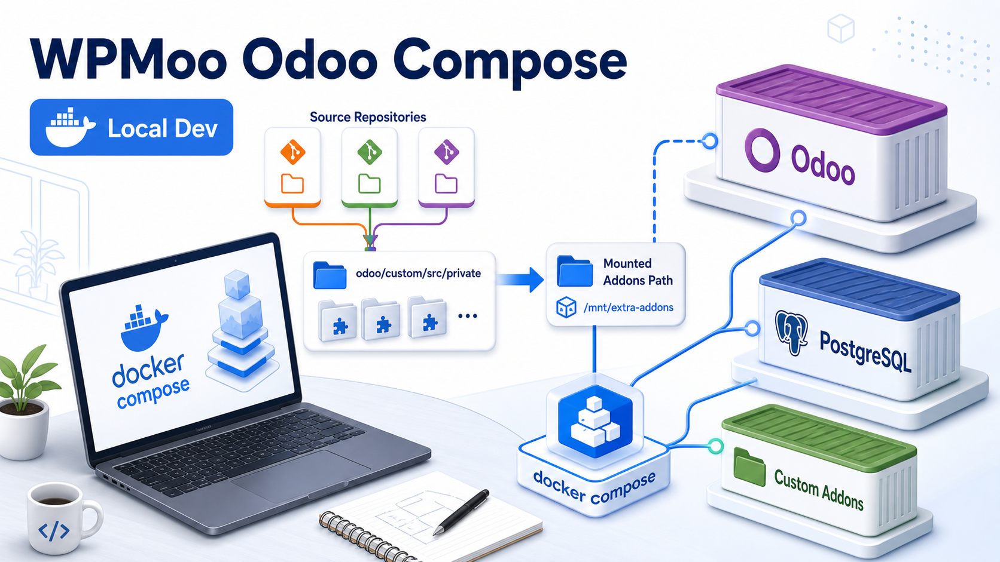

[](https://github.com/wpmoo-org/odoo-docker-compose/actions/workflows/ci.yml) [](LICENSE) [](https://www.buymeacoffee.com/cangir)


# WPMoo Odoo Compose

Lightweight Docker Compose files for local Odoo development. This repository can
be used standalone, or copied into a WPMoo-managed Odoo dev environment by
`@wpmoo/odoo`.

## Compose files

Version-specific compose files are static and easy to inspect:

```text
docker-compose_17.0.yml
docker-compose_18.0.yml
docker-compose_19.0.yml
```

Default standalone settings use Odoo 19 on port `10019`. Image tags can be
overridden in `.env` with `ODOO_IMAGE` and `POSTGRES_IMAGE`.

## Source addons

Standalone custom addons can be placed directly under:

```text
addons/
```

WPMoo source repos are expected under:

```text
odoo/custom/src/private/
```

At container startup, `entrypoint.sh` scans WPMoo source repositories for addon
folders containing `__manifest__.py` and creates symlinks in `/mnt/wpmoo-addons`.
The static Odoo config uses:

```text
/usr/lib/python3/dist-packages/odoo/addons,/mnt/extra-addons,/mnt/wpmoo-addons
```

## Usage with scripts

```bash
cp .env.example .env
./scripts/up.sh
./scripts/logs.sh
```

Open:

```text
http://localhost:10019
```

Run an Odoo shell/container command:

```bash
./scripts/shell.sh
./scripts/odoo-bin.sh --help
./scripts/psql.sh devel
```

Run a module lifecycle or test cycle:

```bash
./scripts/resetdb.sh devel base
./scripts/install.sh my_module devel
./scripts/update.sh my_module devel
./scripts/test.sh my_module
./scripts/test.sh my_module --db devel --mode update --tags /my_module
./scripts/uninstall.sh my_module devel
```

Run local quality checks for addons:

```bash
./scripts/check-addons.sh
./scripts/lint.sh
```

`check-addons.sh` validates discovered `__manifest__.py` files under `addons/`
and `odoo/custom/src/private/` against the configured `ODOO_VERSION`. It also
rejects public addons under `addons/` that depend on private addons under
`odoo/custom/src/private/`.
`lint.sh` takes no arguments. When a `.pre-commit-config.yaml` file is present,
it first runs `pre-commit run -a`, then runs the addon manifest checks. If
`pre-commit` is not installed, install it or remove the config file before
running `lint.sh`.

Create and restore a local development snapshot:

```bash
./scripts/snapshot.sh devel before-large-change
./scripts/restore-snapshot.sh before-large-change devel
```

`snapshot.sh [db] [snapshot-name]` defaults to database `devel` and a timestamped
name. Each snapshot writes `backups/snapshots/<name>.dump`,
`<name>.filestore.tar.gz`, and `<name>.json`. The filestore archive contains the
matching Odoo filestore from `data/filestore/<db>` when it exists.
`restore-snapshot.sh <snapshot-name> [db]` restores the dump and filestore into
the target database, replacing the current local database and filestore for that
database. Snapshot names may contain only letters, numbers, dots, underscores,
and dashes, and may not start with a dash.

Export a translation template with stock Odoo:

```bash
./scripts/pot.sh my_module devel i18n/my_module.pot
```

`pot.sh <module[,module]> [db] [output]` defaults to database `devel` and
`i18n/<first-module>.pot`. The module list can also come from `ODOO_TEST_MODULE`
in `.env`. The command uses stock `odoo i18n export` inside the Odoo container.

Stop:

```bash
./scripts/down.sh
```

Restart only Odoo:

```bash
./scripts/restart.sh
```

## Standalone Docker Compose usage

Without scripts, choose a version-specific compose file:

```bash
cp .env.example .env
docker compose -f docker-compose_19.0.yml up -d
```

For Odoo 18:

```bash
ODOO_VERSION=18.0 docker compose -f docker-compose_18.0.yml up -d
```

## Future reverse proxy

Traefik/reverse-proxy support is intentionally left out of the base template for
now. It can be added later as an optional compose overlay/profile without making
the local development path harder to understand.

## Notes

- Keep local `.env`, `data/`, `postgresql/`, and backups out of Git.
- For production, set real secrets and use a reverse proxy with TLS.
- For multi-version development, create a separate environment/worktree per Odoo branch.


## Support

If this project helps you, you can support the work here:

[](https://www.buymeacoffee.com/cangir)
